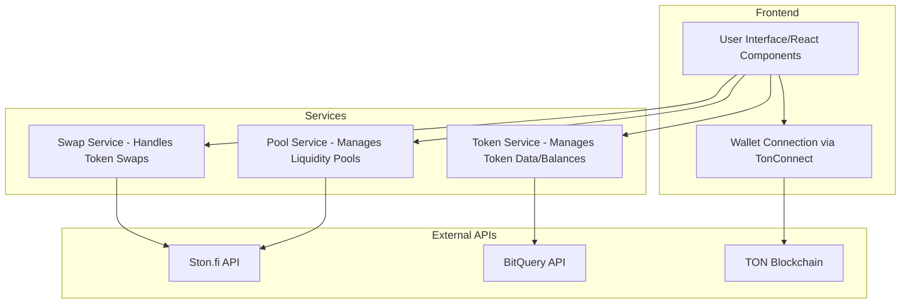

# OXYS DEX: Decentralized Exchange Interface for TON Blockchain

## Abstract

Oxys is a decentralized exchange interface built on the TON blockchain that integrates with Ston.fi's API and SDK for liquidity and trading functionality. The platform provides a user-friendly interface for token swaps, liquidity provision, and pool management, leveraging established infrastructure while focusing on accessibility and ease of use.

## Table of Contents

1. Introduction
2. Technical Architecture
3. Core Features
4. Integration Components
5. Security Considerations

## 1. Introduction

Oxys serves as a frontend interface for decentralized trading on the TON blockchain. Rather than implementing custom smart contracts, the platform integrates with established protocols and APIs to provide reliable trading functionality while focusing on delivering an intuitive user experience.

## 2. Technical Architecture

### 2.1 Frontend Stack
- React.js with TypeScript for type safety
- TonConnect UI for wallet integration
- Tailwind CSS for responsive design
- Vite as the build tool and development server

### 2.2 Key Integrations
- Ston.fi API and SDK for DEX functionality
- BitQuery API for market data and analytics
- TON Connect for wallet management
- TON Access for blockchain interaction

### 2.3 Core Services

The platform is structured around several key services:

- **Pool Service**: Manages liquidity pool interactions and data
- **Swap Service**: Handles token swap operations
- **Token Service**: Manages token data and balances
- **Jetton Service**: Handles jetton deployment and management

## 3. Core Features

### 3.1 Token Swaps
```typescript
interface SwapSimulationResponse {
  ask_units: string;
  offer_units: string;
  swap_rate: string;
  price_impact: string;
  fee_units: string;
  fee_percent: string;
  min_ask_units: string;
}
```

The swap functionality includes:
- Direct token-to-token swaps
- Price impact calculation
- Slippage protection
- Swap simulation before execution

### 3.2 Liquidity Pools
```typescript
interface Pool {
  address: string;
  token0: {
    symbol: string;
    address: string;
    decimals: number;
    verified: boolean;
  };
  token1: {
    symbol: string;
    address: string;
    decimals: number;
    verified: boolean;
  };
  reserves0: string;
  reserves1: string;
  tvl: string;
  volume24h: string;
  apr: string;
  fees24h: string;
}
```

Liquidity pool features include:
- Pool creation and management through Ston.fi
- TVL and volume tracking
- APR calculations
- Liquidity provision and removal

### 3.3 Jetton Deployment
The platform includes functionality for jetton (TON tokens) deployment with the following features:
- Custom token creation
- Metadata management
- Owner controls
- Minting capabilities

## 4. Integration Components

### 4.1 Ston.fi Integration
```typescript
// Asset information structure from Ston.fi
interface AssetInfo {
  balance?: string;
  blacklisted: boolean;
  community: boolean;
  contract_address: string;
  decimals: number;
  symbol: string;
  verification?: string;
}
```

### 4.2 BitQuery Integration
Used for:
- Market data retrieval
- Price tracking
- Trading volume analytics
- Chart data generation

### 4.3 TON Connect Integration
```typescript
interface WalletContextType {
  address: string | null;
  account: string | null;
  isConnected: boolean;
  isConnecting: boolean;
  isInitialized: boolean;
  network: CHAIN | null;
  error: Error | null;
  connect: () => Promise<void>;
  disconnect: () => Promise<void>;
}
```

## 5. Security Considerations

### 5.1 Transaction Security
- Slippage tolerance settings
- Transaction deadline enforcement
- Balance verification
- Input validation

### 5.2 API Security
- Rate limiting
- Error handling
- Data validation
- Secure API key management

### 5.3 User Protection
- Clear error messages
- Transaction confirmation modals
- Price impact warnings
- Balance checks

## Technical Specifications

### Token Verification
```typescript
interface Token {
  address: string;
  name: string;
  symbol: string;
  decimals: number;
  totalSupply?: string;
  logoURI?: string;
  balance?: string;
  verified?: boolean;
  verification?: 'none' | 'whitelist' | 'blacklist';
}
```

### Pool Management
```typescript
interface PoolShare {
  poolAddress: string;
  sharePercentage: string;
  token0Amount: string;
  token1Amount: string;
  lpBalance: string;
  totalLpSupply: string;
  totalValueUSD: string;
}
```

### System Architecture


## Conclusion

Oxys provides a user-friendly interface for decentralized trading on the TON blockchain by leveraging established infrastructure and APIs. The platform focuses on providing a seamless user experience while maintaining security and reliability through integration with trusted protocols and services.

The interface serves as a gateway to decentralized finance on TON, making complex DeFi operations accessible to users through an intuitive interface while relying on battle-tested backend services and APIs for core functionality.
